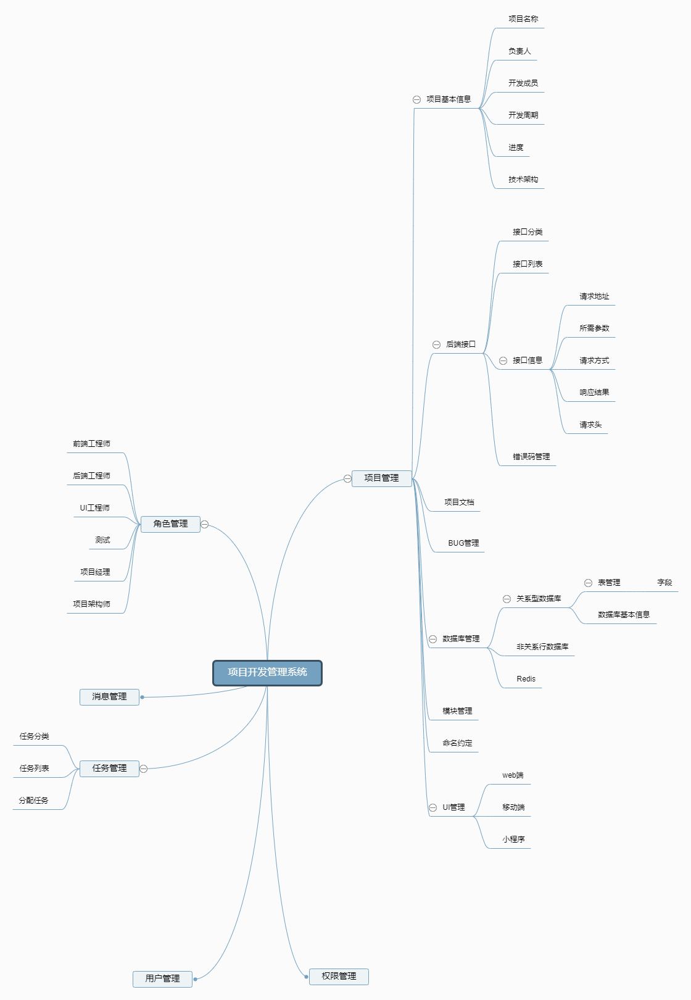

# project-management-system

#### 介绍
一个面向企业的项目管理系统，包含项目进度，后端接口，文档生成，数据表管理，开发人员管理

#### 软件架构
软件架构说明
[百度脑图地址](http://naotu.baidu.com/file/59d4a280cc471e5ba9c8ceba1e3f9122?token=d908c96739607b1c)

#### 安装教程

1.  xxxx
2.  xxxx
3.  xxxx

#### 使用说明

1.  xxxx
2.  xxxx
3.  xxxx

#### 参与贡献

1.  Fork 本仓库
2.  新建 Feat_xxx 分支
3.  提交代码
4.  新建 Pull Request

